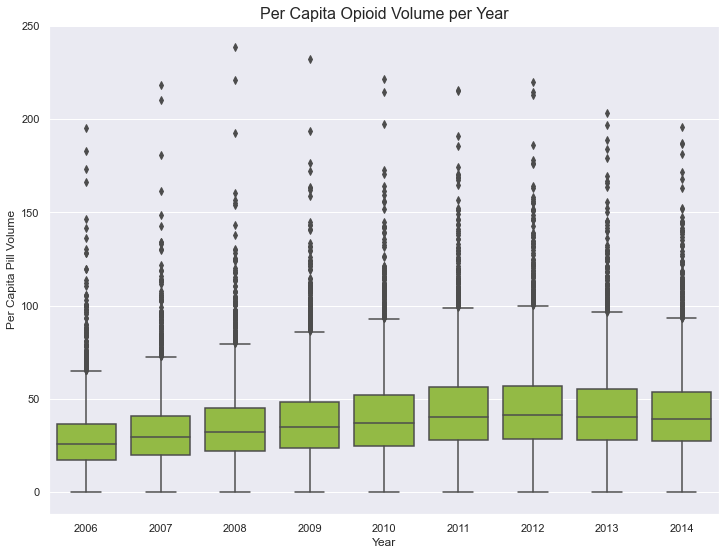
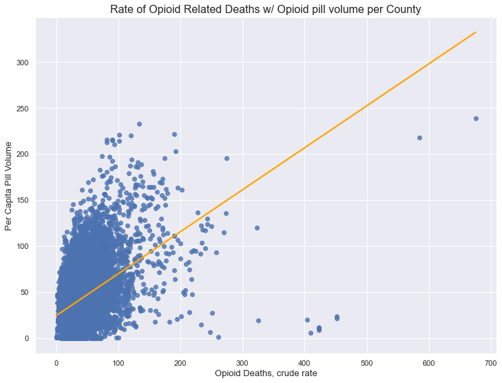
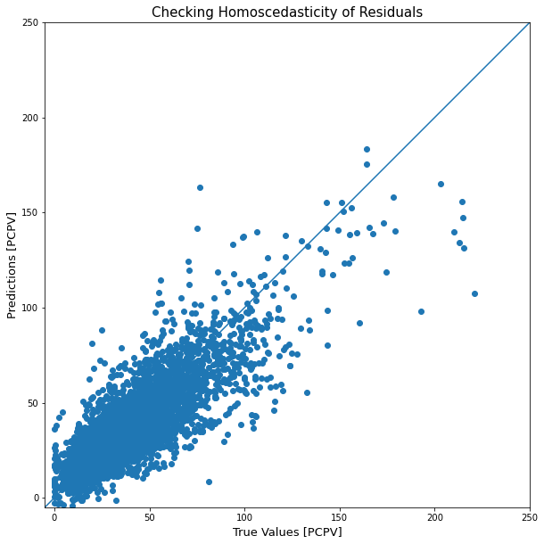
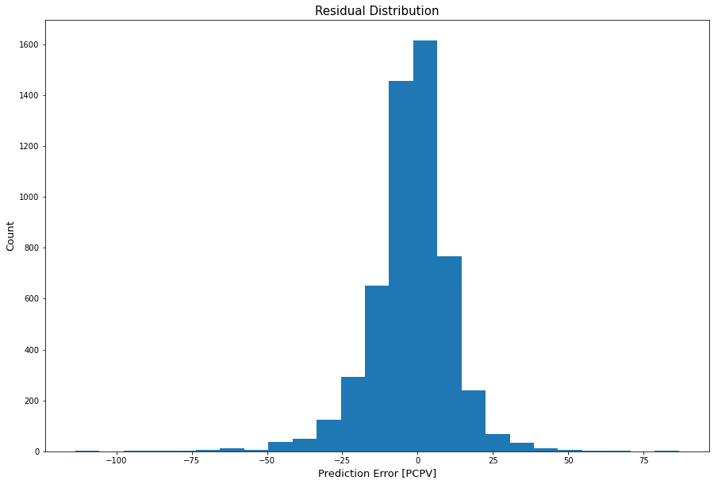

# Analysis and Predictions of Opioid Volume per U.S. County 

### Problem Statement

The goal for this project was to take data from several U.S. federal resources between the years 2006-2013, containing information at a county-wide level on demographics, healthcare demand, infrastructure and opioid-related variables to determine which factors predict the volume per capita of opioid pills in each county. 

#### Original Goal and Further Study
Originally, this project set out to determine if federal regulation, in the following time after the opioid crisis was reported on, had a significant impact on the opioid death rate and non-prescription drug overdose deaths as a whole. However, data discovered in the turn-around time for this project morphed its goal into what it is now. If there is to be further work done on this project, more recent data is needed to determine the original goal. 

#### Data Dictionary

Obtained from the National Library of Medicine, National Center for Biotechnology Information
##### Authors: 
Kevin N. Griffith, Yevgeniy Feyman, Samantha G. Auty, Erika L. Crable, and Timothy W. Levengood
##### Sources:
- [Washington Post's ARCOS data extract](https://www.washingtonpost.com/national/2019/07/18/how-download-use-dea-pain-pills-database/)
- [Health Resources & Services Administration's Area Health Resources Files (AHRF)](https://data.hrsa.gov/topics/health-workforce/ahrf)
- [Centers for Disease Control & Prevention's Wide-ranging Online Data for Epidemiologic Research](https://wonder.cdc.gov/)
- [National Conference of State Legislatures](https://www.ncsl.org/research/health/scope-of-practice-overview.aspx)
##### Data Brief and Repository: 
- [County-level data on U.S. opioid distributions, demographics, healthcare supply, and healthcare access](https://www.ncbi.nlm.nih.gov/pmc/articles/PMC7881250/)
- [Data Download](https://data.mendeley.com/datasets/dwfgxrh7tn/6)

| Variable Name | Description |
|:---|:---|
| ord_cdr | Crude opioid-related death rate, imputed |
| unemploy_rate | Unemployment rate for ages 16+ |
| arf_cdr | Crude annual death rate, all cause |
| prcnt_poverty | Percent in poverty |
| pct_medicare | Percent eligible for Medicare |
| pct_duals | Percent dual-eligible for Medicare & Medicaid |
| hpsa_part | Healthcare professional shortage area (primary care) - partial county |
| nonmetro | Nonmetropolitan indicator based on the USDA Rural-Urban Continuum Code |
| op_pc | Outpatient visits per capita |
| per_cap_medicare_cost | Actual per capita Medicare cost |
| pdmp_req_check | Prescription drug monitoring programs (1 if providers are required to check the state's PDMP before prescribing opioids, 0 otherwise) |
| spec_55t64_pc | Medical specialists aged 55 to 64 per 100,000 residents |
| spec_65t74_pc | Medical specialists aged 65 to 74 per 100,000 residents |
| dentists_65plus_pc | Dentists aged 65+ per 100,000 residents |
| med_househld_income | Median household income in dollars |
| hpsa_whole | Healthcare professional shortage area (primary care) - whole county |
| prcnt_25up_college | Percent aged 25+ with 4+ years of college |
| pct_men | Percent males |
| rural | Rural indicator based on the USDA Rural-Urban Continuum Code|
| per_cap_income | Per capita personal income in dollars |
| pct_hisp | Percent Hispanic |
| np_rx | Nurse practitioner prescribing authority (1 if the state allows nurse practitioners to prescribe opioids, 0 otherwise) |

### Metrics Measured

The metrics for this project is to accurately predict future per capita pill volume (PCPV) for each county with a model that will explain a certain percentage in variability in that target. Training a model is the key importance here; balancing the bias of an overfit model with variance given by strong features to train on. Once a large enough portion of the variability can be explained, coefficients and feature importance will be analyzed to determine which factors of a county contributed the most to the target's prediction values. 

### Results

From the coefficients taken from the best model fit, the top ten factors of a county included the wealth of the county residents, if the county was suffering from any health care shortages, and the annual death rate of residents in the county. Counties that were identified by the USDA Rural-Urban Continuum Code as ‘rural’, with all else held constant, saw an average decrease in pill volume of about 16.19 units. Similarly, all counties labeled as ‘non-metro’ saw an average decrease in pill volume of about 0.84 units.
Running a Gradient Boosting model, that solves for the loss of each prior model it’s fitted to, it returns coefficients that were important to the decision making in each model that minimized the loss. Taking the top spot of importance of these coefficients was the crude annual death rate of opioid overdose, making up 31.6% of the decisions that minimized the loss function. The next nine values range from the wealth of the county residents, to the medical factors of their facilities and personnel. 

#### Limitations and Assumptions

Limitations arrive in the data that was studied; although it is during the time that this crisis was at its peak some would say, more recent data would give the ability to make more accurate future predictions of PCPV for each county. As for the findings, there was the assumption that residents in more rural areas would be largely susceptible to opioid addiction and therefore seek more of the drug. But as the data seems to suggest, pill volume is generally  correlated to metro areas due to their high density in medical practices and residents. This would also explain why persons who are dually eligible for both Medicare and Medicaid, the senior and financially needy, played a great importance in the decision making of the model as well. Metro areas are more likely to house several nursing homes for seniors that qualify in this category. 

#### Conclusion

Almost to no surprise, there is a strong relationship between the amount of pills a county received and the opioid-related death rate. Counties with higher poverty and unemployment rates have a higher chance of getting more opioids shipped there Going forward, I would like to collect data on the third wave of opioid overdoses and see if pill volume is still a factor in the overall rate of death from these drugs, or if it’s solely illicit use. There have been multiple policy implementations after recognition of the crisis. The National Pain Strategy in 2010 replaced noncohesive policy from the late 1990s, and most recently the Comprehensive Addiction and Recovery Act was signed into law in 2018. For those already addicted, there needs to be a push for further implementation of Harm Reduction when it comes to the continuum of care. These services can connect people to overdose counseling, distribute opioid overdose reversal medications, and reduce overall deaths linked to these drugs. (Syringe service programs, Fentanyl test strips, Naloxone and overdose education kits)

#### Data Packages Used

- [Pandas](https://pandas.pydata.org)
- [NumPy](https://numpy.org)
- [MatplotLib](https://matplotlib.org)
- [Seaborn](https://seaborn.pydata.org)
- [Scikit-learn](https://scikit-learn.org/stable/)
- [TensorFlow](https://www.tensorflow.org)
- [TensorFlow Addon](https://www.tensorflow.org/addons/api_docs/python/tfa)

